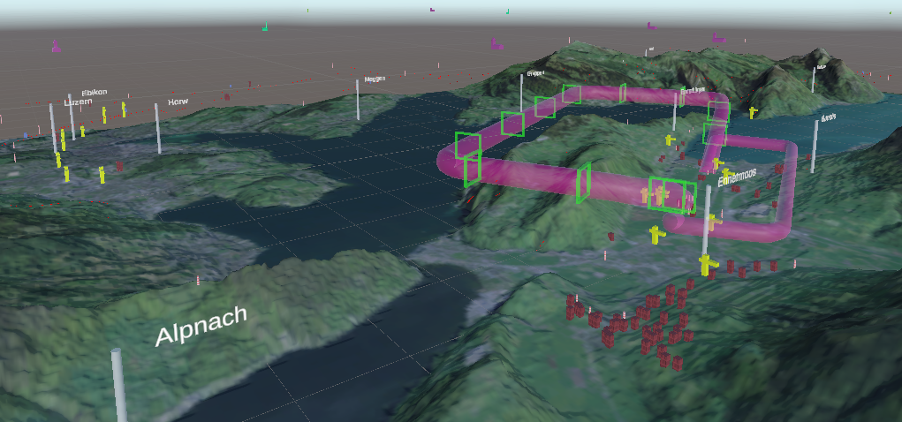

# An In-Flight Extended Reality Tool for General Aviation Situation Awareness
Repository of MSc Thesis by Thierry Weber at ETH Zurich
## Abstract
Flights in General Aviation (GA) are commonly operated under Visual Flight Rules (VFR). Under VFR, pilots navigate by comparing features on the earth’s surface to a 2D map. This mental process entails a focus split between inside and outside the cockpit. The focus split decreases the mental capacity of the pilot. Other tasks, such as looking out for traffic, are neglected, thus the overall situational awareness of the pilot is reduced. Although paper maps are still encouraged to be used as a main navigation tool, 2D moving maps on mobile devices are getting more popular to support the pilot with digital information. However, displaying information in 2D in an attempt to capture the 3D world in which the flight takes place is still inadequate. Projecting flight-relevant information directly into the real world would be the logical next step. Despite Augmented Reality (AR) technology being already used in commercial aviation, no such tool exists to support GA pilots. This work explored the effect of AR technology on the situation-al awareness of a pilot in a GA aircraft operation under VFR. While the main focus of the still sparse research for AR technology in the GA sector lies either on highlighting traffic or implementing an ap-proach guidance tool, this work expanded the possibility of more geographically relevant information during different phases of VFR flight. An AR application was developed for Microsoft HoloLens 2, featur-ing six scenarios set in Switzerland, integrating non-visible aeronautical information, VFR navigation fea-tures, and hard-to-see hazards. A user study with 19 pilots in a flight simulator was conducted to evalu-ate the tool’s effect on situational awareness. The results indicated that the AR tool positively influenced situational awareness, particularly in disorientation scenarios during cruise flight in unfamiliar areas. The novel 3D visualization of airspace structures and the tool’s ability to identify and display the current and upcoming airspace were found to enhance situational awareness. However, the effect of AR during ap-proach phases was less conclusive, likely due to the early development stage of the application and limitations of the flight simulator. Participants raised concerns about the potential occlusion and distrac-tion from real-world environment due to the AR content, which could negatively impact situational aware-ness. Moreover, an AR menu was evaluated as an interaction method within the application but found not optimal for a cockpit environment. 

