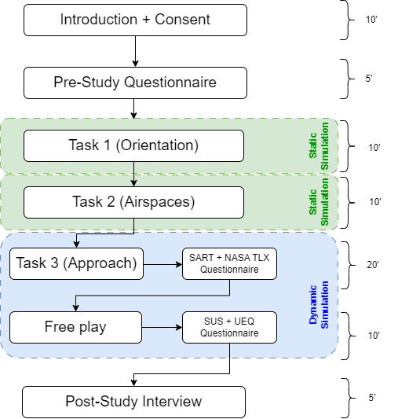

# An In-Flight Extended Reality Tool for General Aviation Situation Awareness

Repository of MSc Thesis by Thierry Weber at ETH Zurich

<a href= "MSc_Thesis_weberth_report_final_with_declarationoforiginality.pdf" alt=""> Full Report </a>

## Abstract
Flights in General Aviation (GA) are commonly operated under Visual Flight Rules (VFR). Under VFR, pilots navigate by comparing features on the earth’s surface to a 2D map. This mental process entails a focus split between inside and outside the cockpit. The focus split decreases the mental capacity of the pilot. Other tasks, such as looking out for traffic, are neglected, thus the overall situational awareness of the pilot is reduced. Although paper maps are still encouraged to be used as a main navigation tool, 2D moving maps on mobile devices are getting more popular to support the pilot with digital information. However, displaying information in 2D in an attempt to capture the 3D world in which the flight takes place is still inadequate. Projecting flight-relevant information directly into the real world would be the logical next step. Despite Augmented Reality (AR) technology being already used in commercial aviation, no such tool exists to support GA pilots. This work explored the effect of AR technology on the situation-al awareness of a pilot in a GA aircraft operation under VFR. While the main focus of the still sparse research for AR technology in the GA sector lies either on highlighting traffic or implementing an ap-proach guidance tool, this work expanded the possibility of more geographically relevant information during different phases of VFR flight. An AR application was developed for Microsoft HoloLens 2, featur-ing six scenarios set in Switzerland, integrating non-visible aeronautical information, VFR navigation fea-tures, and hard-to-see hazards. A user study with 19 pilots in a flight simulator was conducted to evalu-ate the tool’s effect on situational awareness. The results indicated that the AR tool positively influenced situational awareness, particularly in disorientation scenarios during cruise flight in unfamiliar areas. The novel 3D visualization of airspace structures and the tool’s ability to identify and display the current and upcoming airspace were found to enhance situational awareness. However, the effect of AR during ap-proach phases was less conclusive, likely due to the early development stage of the application and limitations of the flight simulator. Participants raised concerns about the potential occlusion and distrac-tion from real-world environment due to the AR content, which could negatively impact situational aware-ness. Moreover, an AR menu was evaluated as an interaction method within the application but found not optimal for a cockpit environment. 
## Goals
The goal for this thesis is to develop an Augmented Reality (AR) tool to support the situational aware-ness of general aviation (GA) pilots and test it in a user study. During the development, the focus should be on visualizing non-visible aeronautical information (e.g., airspace structures, advisory points, way-points, approach procedures, etc.) and hard-to-see hazards (e.g., antenna towers, traffic, wires, cable cars, etc.). Additionally, displaying information aiding pilots with their tactical decisions during flight under VFR could be beneficial for situational awareness in flight (e.g., airports, villages, mountain peaks, etc.). To be able to measure the performance of the application, the following research question and hypothe-ses were formulated: 
- RQ: What are the effects of an augmented reality tool to the situational awareness of the pilot in a gen-eral aviation cockpit?  
- H1: AR will allow the pilot to raise the situational awareness by noticing hazards faster.
- H2: AR will increase situational awareness by increasing awareness of nearby airspace structures.
- H3: AR can support regaining location awareness in case of disorientation.
- H4: AR will allow to fly the planned flight more accurately and precisely.

## Vision
With the goal in mind, a vision of what the application could look like was created by overlaying digital content as sketches on photographs taken inflight. The photographs were taken by the author. Figure 4 shows the vision for two different flight phases. In the left image, a cruise flight scenario is captured, while on the right image, an approach is depicted. The information displayed was already selected to support finding an answer to the research question however, the exact information types to be displayed were evaluated more thoroughly before starting the development of the application. 
During cruise flight, the task of orientation is imagined to be supported by highlighting town names, ob-stacles like power lines, and points of interest such as power plants and monasteries. Another idea in the vision was to display the surrounding airspace structure to raise the awareness of the pilot on where the boundaries of airspace sectors are. Some sort of menu should be included to toggle different information.
During an approach, the circuit layout is envisioned to be projected into the real-world as gates to fly through (green gates in Figure 4). Information about the destination airport should be displayed near the airport to make the pilot aware of radio frequencies, runway directions, runway length and elevation of the airport.

## Application Development
### Software Architecture

### Visualization

    
   
   
    
    
   
  
  

### Interaction

Next to the toggle on and off information, the menu includes a slider to select the projection range. Us-ers select the distance in reference to their own position in which information should still be displayed. This function is important for decluttering information in certain flight phases. During cruise flight, when flying at higher speeds, it is important to be mentally ahead of the airplane, and therefore setting the projection range higher makes sense. During approach however, reducing the range makes sense, as the airplane maneuvers at slower speed in a tighter geospatial area. The bottom section of the menu displays information about surrounding airpace sections. 

 

## Application State

The snapshots below showcase the application as used in the user study.

   
   
   

https://github.com/user-attachments/assets/a99666e9-60ca-458a-a764-50fdaf1e8808

## User Study

 Workflow diagram showing the study procedure per participant.

 

## Results 

### Task 1 (Orientation)

 Task 1 was about gaining orientation in a scenario of disorientation. Participants were asked to mark the 
plane’s position on a map, with the help of the AR tool and without. The figures below shows the mean distance 
between the actual position of the aircraft and the guesses on the left. The boxplot on the right indicates 
the distribution of the answers per location and condition. The great circle distances were calculated from 
the coordinates with the help of the haversine formula. It is clearly visible that the distance is smaller in the 
condition with the AR tool. The boxplots indicate that the guesses in the condition without AR are wider 
spread than in the condition with AR. Additionally, the condition without AR shows more substantial outli
ers. Interesting to mention is, that the median deviation of the Zweisimmen scenario with AR is higher 
(orange line in the left plot in figure below). 
The discoveries made in Figure 38 coincide with the plots in Figure 39. In this figure again, red represents 
the condition with AR and blue the one without AR. The dots show the marked positions in latitude and 
longitude. The blue arrows indicate that there are guesses outside of the area in the plot. By qualitatively 
analyzing the plots, the pattern indicates a higher accuracy and precision in the condition with AR in 
Entlebuch. However, the contrast between the conditions is less clear in the scenario Zweisimmen (bottom 
row). More data would increase the significance of the result and help better recognizing pattern.

   
  
  

    
### Task 2 (Airspace)

The second task was about finding the position and then stating in what airspace section the airplane is 
in, plus what airspace section comes five nautical miles ahead of the current position and orientation of 
the aircraft. Table 4 presents the results. The correct airspace section is included in the table. It stands out 
that only a few mistakes were made regarding the airspace section the aircraft is independent of the con
dition or location. While in the with AR condition all participants were able to state the correct airspace the 
aircraft is in, in the without AR condition, three participants made a mistake summed on both locations. 
The only mistake with the AR tool at hand was for the determination of the airspace ahead in the Wil SG 
scenario. The without AR condition led to half of the answers being false. 

### Task 3 (Approach)

Task 3 was the only dynamic situation in this user study. The participants were asked to fly an approach 
according to the published route on the VAC chart of the respective airport (see Figure 36 and Figure 37 
in Chapter 5.2.3). Here again, the participants had the chance to use the AR tool for one of the approaches. 
Meaning they either approached the airport of Buochs or Grenchen with AR guidance. Participants were 
allowed to study the VAC chart in both conditions. Figure 40 shows plots of the altitude profiles in all 
conditions and locations. The x-axis indicates the distance from the touch-down point in nautical miles, 
while the altitude (in feet about mean sea level) is represented on the y-axis. The black dotted line repre
sents the manually modeled circuits according to the VAC chart with a descent of around 4 degrees. The 
horizontal part of the circuit represents the downwind altitude. The exact distinction between downwind, 
base and final leg is not directly visible in the plots. The dark gray area is a buffer of about 100 feet, which 
is a widely accepted deviation from the target altitude. The vertical (red) dotted line indicates the approxi
mate intended point of interception between the altitude profile and circuit altitude. As the circuit includes 
the take-off phase as well, only the part right of the red line is to be compared to the circuit. The circuits 
were modeled manually; hence, they include some buckling in the vertical profile.Concentrating on the flight paths for the scenario in Grenchen (top row), the altitude profile with AR seems 
to match the circuit slightly better. The flight paths without AR tend to be a bit too low on downwind and 
only march onto the glide path on the final approach leg. Another observation to be made is the fluctuation 
of altitude in the with AR condition seems to be slightly higher than in the without AR condition, indicating 
a more unstable approach. One participant did not manage to land the airplane in Grenchen (flight path 2 
in the top left plot) in the with AR condition. In general, the final approach leg seems to be flown more 
stable in the without AR condition. Looking at the interception, it seems that spread in the different flight 
paths is smaller in the with AR condition.  
Comparing the profiles in the Buochs scenario (bottom row), the flight profiles in the with AR condition are 
above the circuit altitude until the short final, hence a steeper approach was flown. In contrast to that, the profiles without the AR tool appear to be on or even below the intended glide path. In this second location, 
the fluctuation in altitude isn’t notably different. The vertical profile of the final approach leg is steadier in 
the with AR condition at Buochs. Interesting to see is that two participants gained altitude upon interception 
with the circuit and flew the downwind leg with almost 500 feet above the published circuit altitude (in the 
with AR condition). This led to an even steeper final descent.  
Next to inspecting the flight path laterally, it is also interesting to look at them from a top-down view. Figure 
41 (see next page) helps to compare the routes geographically. Here again, the black line represents the 
circuit as published on the VAC chart. Red lines correspond to paths flown with AR and blue lines to paths 
flown without AR. Each of the two columns represents one location.  
Examining the Buochs scenario (left column) first, the interception at the beginning of the downwind leg 
(as published) was flown more precisely in the condition with AR. Although one participant overshot the 
path into the infield area and another did only intercept the downwind at the end. One participant started 
intercepting a left-hand downwind for the opposite runway then given in the assignment for this task, which 
was communicated by the conductor, hence the 180 degree turn in one of the blue lines. In general, the 
downwind leg during the without AR condition was flown north of the defined route and not exactly in the 
opposite direction of the runway. This led to a slow intercept with the downwind leg. A few participants 
managed to fly the downwind in a correct heading, just turned into the direction too early with no AR 
guidance. The base leg was rounded off into a downwind to final turn more often in the condition without 
AR condition. Hence, the specified base leg is better visible in the with AR condition. The airport in Buochs 
only becomes apparent in the base to final turn, thus in both conditions the participants overshot the final 
turn. As soon as the runway was insight, the alignment with the runway center line was achieved even a 
bit faster without the AR tool.  
Moving on to the Grenchen scenario (right column), the circuit is tighter and lower above the ground than 
in Buochs. In this scenario, the participants managed to better follow the circuit without the AR tool as an 
aid compared to the approach in Buochs. Thus, the difference between with AR and without is not as clear. 
However, there are a few things worth mentioning. Starting with the interception point of the downwind. 
The AR tool seemed to have helped, as the flight paths are closer together at this point. Two of the partic
ipants flew far south of the defined downwind leg in the without AR condition. One participant landed on 
the opposite runway, contradicting the assigned task. The left turn before turning base is less pronounced 
when flown without AR tool. Although this turn is better recognizable in the with AR scenario, it seemed to 
be difficult to follow the gates in this turn for some of the participants. This resulted in shortened base and 
final legs and for one participant even had the consequence of not being able to land at the airport (red 
line with 180-degree turn furthest south in the middle plot). The unstable final approach in the with AR 
condition, as already seen in the vertical profiles, is also confirmed in the top-down view.  

   
    
   
     
   
   
   
   
  

The following link leads to a 3D web map displaying the recorder flight paths: 

<a href="https://n.ethz.ch/~weberth/FlightPATH3DWebmap" target="_blank">3D Web Map</a>

## Conclusion and Future Work

 This work explored the effect of AR on the situational awareness of a pilot in a General Aviation (GA) aircraft operation under Visual Flight Rules (VFR). While the main focus of the still sparse research for AR technology in the GA sector lays either on highlighting traffic or implementing an approach guidance tool, this work expanded the possibility of more geographically relevant information during different phases of VFR flight. As the related work, this thesis was able to prove a positive effect of AR tools on situational awareness. However, this effect turned out to be highly dependent on the scenario, visualiza-tion and individual preference of the subject. An application for the Microsoft HoloLens 2 was developed, to evaluate the hypotheses. It included six scenes linked to different regions in Switzerland. The infor-mation integrated consisted of non-visible aeronautical information (airspace structures, advisory points, waypoints, approach procedures etc.), features used in VFR navigation (town names, POIs, etc.) and hard-to-see hazards (e.g., antenna towers, wires, power lines, etc.). The application was used in a user study conducted with 19 pilots in a flight simulator setup. The study was built to be a with-subject design and was tailored to the hypotheses. Three main tasks allowed to get detailed results on the difference between solving navigational challenges with and without an AR tool as an aid. Qualitative and quantita-tive measures were taken and analyzed. A short post-study interview aimed to gather opinions on the idea of using AR technology in GA cockpits.

The mental process of conventional map reading involves the search for features on the map and cross-referencing them in the real world. Especially in regions with less dominant terrestrial characteristics, the identification of a position is challenging and can be misleading. The study has shown that the AR tool was able to benefit this process of regaining location awareness in case of disorientation inflight. Project-ing information about terrestrial features (e.g., the names of towns), reduces the workload for cross-referencing (if even needed) on a map and therefore improves the situational awareness of the pilot. It was found that such a tool is especially helpful during cruise flight in unfamiliar areas

Another novelty of this thesis is the 3D visualization of airspace structures in AR. Additionally, the appli-cation is aware of what airspace structure the airplane is currently in and what airspace is 5 nm mile ahead. This information is presented to the user in text form within the application, allowing them to ef-fortlessly identify what airspace structure they are in, hence increasing situational awareness. This was proven throughout the user study by letting the participants state the airspace section in the simulation and comparing the results of both conditions (with and without AR). 

A third task of the study assessed the advantages of AR in an approach scenario, similar to Katins (2023a). Although the results were not favoring the with AR condition as clearly as in the study by Kat-ins, the analysis showed indications on positive effects of augmented information during an approach. The dampened effect is believed to be due to the development state of the application, but also the physics of the flight simulator setup used in this study. The stated factors led to a decrease in trust in the quality of the information presented. When comparing the recoded flight paths, it can be said that the AR tool especially helps flying approaches more accurately in areas with less terrestrial features. During the post-study interview, this tool was found to be most useful for approaches into unfamiliar airports. Look-ing at the results of a self-rated situational awareness scale, the scores favor the without AR condition. The task load was rated with no significant difference between the conditions. Here, the application has to be developed further and tested with more participants to make a profound general statement about the effect of AR on situational awareness in an approach scenario. Additionally, more thoughts have to be put into the visualization of the circuits.

To summarize, this work picks up on the current state of research for AR technology in the GA sector by studying the effect of AR on the situational awareness of pilots. It does so by presenting novel, world-referenced visualizations of flight-relevant information for different flight phases. The results were com-parable to those from the related work. Although the AR aid was proven to have a positive effect on situational awareness, there are some indications that new challenges arise by using this new technology as a navigation aid. For example, a concern raised by the participants is the potential of distraction from real-world information by the projected information. This can cause negative effects on the situational awareness. The majority of the participants were excited to test this new to them technology and stated that such a tool has huge potential as a next step in the evolution from moving maps. Nevertheless, it was mentioned that pilots could be tempted to rely on this tool so much that they unlearn to navigate without digital aids. This could lead to potentially dangerous situations in case of malfunctions of the electronic device. 

Finally, it has to be said that the results have to be interpreted with caution, as statistical significance for the majority of the results was not reached with a group of 19 pilots. Adding to that, in the authors opin-ion, the hardware (smart glasses/AR devices) has to evolve in order to raise the usability of such a tool to a level where it is widely accepted by the public. 

As suggested by Katins (2023b), this work included research on interaction with AR applications for the GA sector. However, following the results and feedback of the users, the research has to be extended in future work. As suggested in the previous chapter, evaluating the requirements of a touch-pad interac-tion for an AR tool in the GA cockpit turns out to be an interesting topic to study further. Maybe, com-pare it with other modes of interaction, such as mouse interaction or gaze interaction.

Furthermore, expanding the research on the distraction and occlusion caused by AR content in a GA cockpit is necessary to better understand its effects on the situational awareness. Hereby, a study on optimal adaptability of the projected information in different phases of the flight could stand in focus. Putting more thoughts into the optimal visualization of flight relevant information in a cockpit environment is another topic to look into in future work. As the digital content is projected on transparent glasses, the effects of various environmental factors such as sunlight, vibrations, or g-forces have to be tested in a real world aircraft. This is the only way to make sure the projections are usable in a real cockpit envi-ronment. 

Throughout the user study of this work, no significant weather was programmed into the scenarios. Fu-ture studies could involve assessing the use of AR in adverse weather conditions. The author believes that further adaptation of the projected content to the surrounding weather is needed to support the situational awareness of a pilot most effectively. 

Last but not least, implementing the functionalities and integrating the information suggested by partici-pants during the post-study interview in an AR application will help the still young field of research. 

## Acknowledgement
I would like to thank my supervisor, Adrian Sarbach, for the well-structured guidance throughout this project and the lively discussions. Additionally, I thank all the participants of my user study, whose valu-able time, insights, and feedback were crucial in shaping the outcomes of this research. Further, I ex-press my gratitude to the “Zentrum für Aviatik” (ZAV) at ZHAW for showing me their flight simulator and the exchange in current research topics between the ZAV and the Chair or Geoinformation Engineering at ETH Zurich . Finally, I would like to thank Prof. Dr. Martin Raubal for the opportunity to work on this thesis in the Chair of Geoinformation Engineering at ETH Zurich. 
